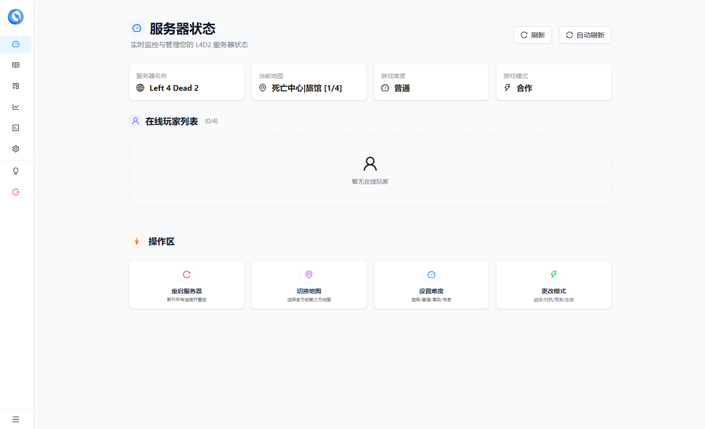
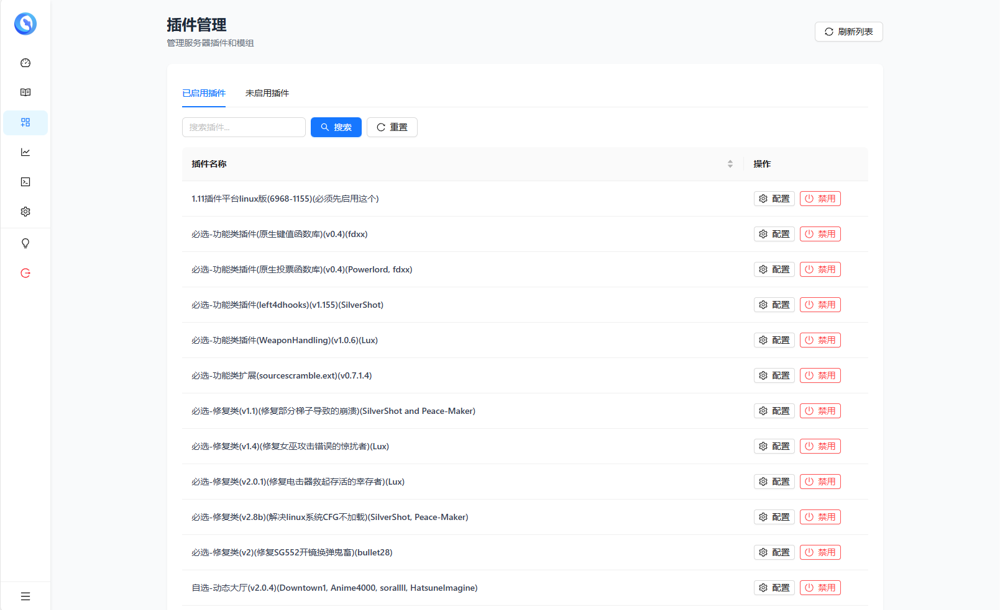
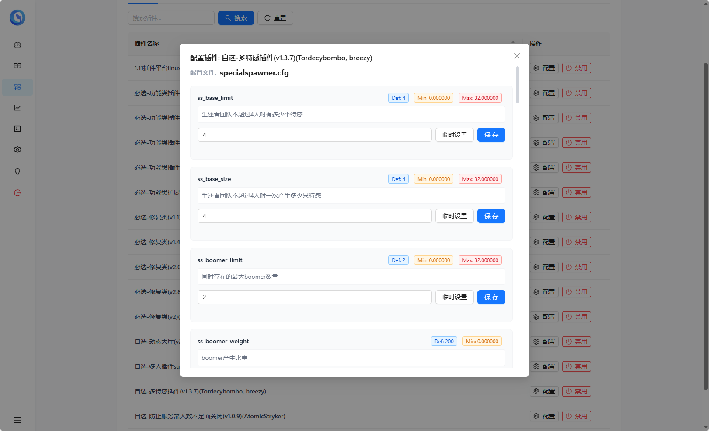
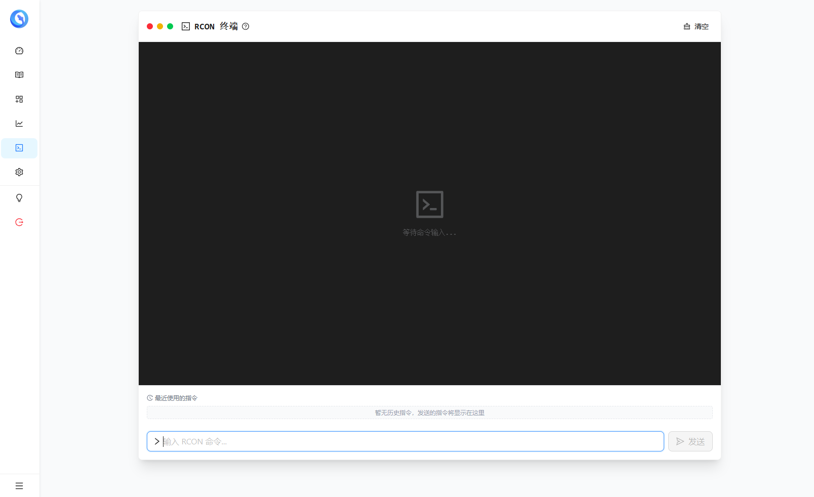
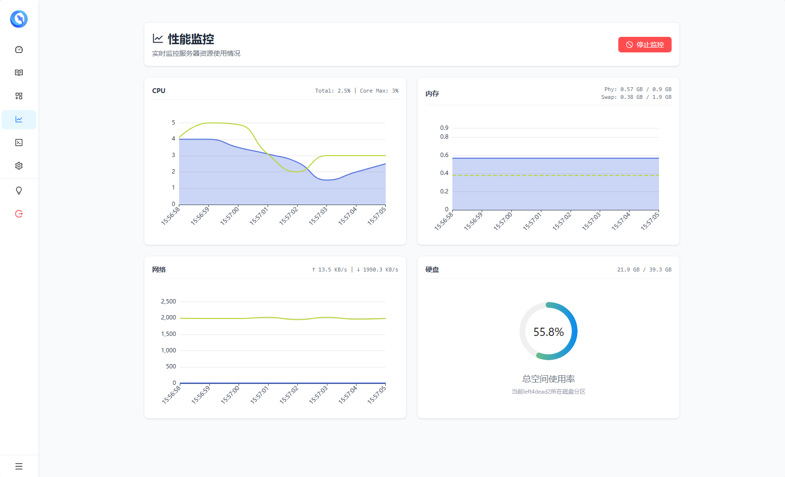
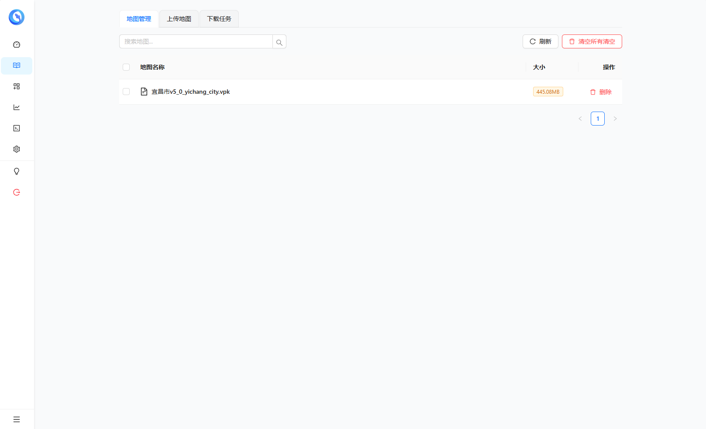
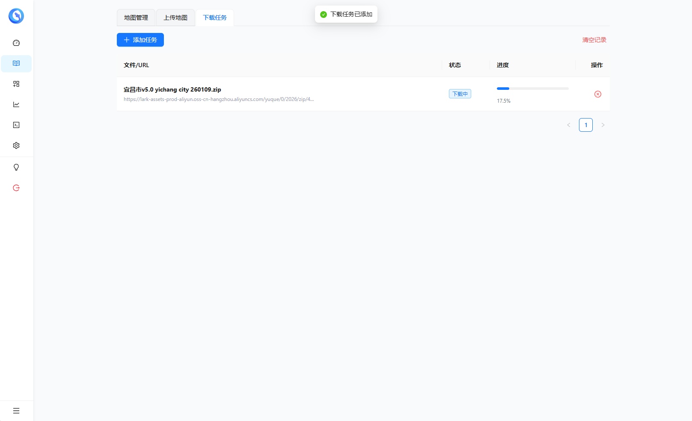

# l4d2-server-next

新一代求生之路 2 (L4D2) 服务器与 Web 管理后台。
提供 Docker 镜像与 Windows 原生程序，内置完整的整合包和大量优质插件，开箱即用！
支持地图管理、插件管理、服务器状态监控、RCON 控制台等功能，让服务器管理变得简单高效。

## ✨ 功能特性

*   **🖥️ 多平台支持**
    *   **Docker**: 提供完整的游戏服镜像（`l4d2-pure`）与管理器镜像（`l4d2-manager-next`），一键部署。
    *   **Windows**: 提供原生 `.exe` 管理器，无需 Docker 即可管理现有的 Windows 服务器。
    *   **Linux**: 支持管理宿主机直接运行的 L4D2 服务端。
*   **🗺️ 地图管理**
    *   支持 `.vpk` 及 `.zip/.rar/.7z` 压缩包拖拽上传。
    *   自动解压安装地图文件到正确目录。
    *   地图下载任务：支持后台下载地图文件到服务器。
    *   可视化地图列表，支持一键切换地图、修改游戏模式、修改难度。
*   **🔌 插件管理**
    *   Web 端查看已安装的所有 SourceMod 插件。
    *   支持在线上传插件文件。
    *   支持在线启用/禁用插件。
    *   **内置整合包**: 镜像中已包含 SourceMod、Metamod 以及大量热门实用插件，开箱即玩。
*   **📊 服务器监控**
    *   实时仪表盘：显示 CPU、内存占用率。
    *   网络状态：监控服务器网络延迟与丢包率。
    *   游戏状态：显示当前地图、模式、难度、玩家数等。
    *   玩家列表：查看当前在线玩家、SteamID、连接时长、Ping 值。
*   **💻 RCON 控制台**
    *   Web 端直接发送 RCON 指令，无需登录游戏。
    *   支持快捷指令菜单。
    *   快捷操作：踢出玩家、封禁 SteamID、修改服务器参数。
*   **🛡️ 安全与权限**
    *   Web 后台密码保护，防止未授权访问。
    *   内置 `!root` 游戏内指令，通过密码快速获取管理员权限（无需手动编辑 admins_simple.ini）。
*   **📂 文件管理** (部分实现)
    *   支持下载任务管理，远程下载大文件到服务器。

## 📸 预览截图

<div align="center">
  
  
  <br/>
  
  
  <br/>
  
  
  <br/>
  
  
</div>

---

## 🚀 Linux 部署

### 1. 完整部署 (游戏服务器 + 管理器)

适合从零开始搭建服务器的用户。

#### 方式一：一键脚本 (推荐)

```sh
bash <(curl -sL https://raw.githubusercontent.com/LaoYutang/l4d2-server-next/master/manifest/install/install.sh)
```
国内加速：
```sh
bash <(curl -sL https://gh.dpik.top/https://raw.githubusercontent.com/LaoYutang/l4d2-server-next/master/manifest/install/install.sh)
```

#### 方式二：Docker Compose

创建 `docker-compose.yaml`：

```yaml
volumes:
  l4d2-data:

networks:
  l4d2-network:

services:
  # 游戏服务器
  l4d2:
    image: laoyutang/l4d2-pure:latest
    container_name: l4d2
    restart: unless-stopped
    ports:
      - "27015:27015"
      - "27015:27015/udp"
    volumes:
      - l4d2-data:/l4d2/left4dead2
    networks:
      - l4d2-network
    environment:
      - L4D2_TICK=60 # 30,60,100
      - L4D2_RCON_PASSWORD=[rcon密码] # 请修改此处

  # 管理器
  l4d2-manager:
    image: laoyutang/l4d2-manager-next:latest
    container_name: l4d2-manager
    restart: unless-stopped
    ports:
      - "27020:27020"
    volumes:
      - l4d2-data:/left4dead2 # 与游戏服务器共享数据卷
      - /proc:/host/proc:ro # 挂载宿主机进程信息用于监控
    environment:
      - L4D2_RESTART_BY_RCON=true
      - L4D2_MANAGER_PASSWORD=[web管理密码] # 请修改此处
      - L4D2_RCON_URL=l4d2:27015
      - L4D2_RCON_PASSWORD=[rcon密码] # 与上方保持一致
      - L4D2_GAME_PATH=/left4dead2
      - HOST_PROC=/host/proc/1 # 指定宿主机进程路径
    networks:
      - l4d2-network
```
启动：
```sh
docker-compose up -d
```

### 2. 仅部署管理器 (Linux)

适合已有 L4D2 服务器（Docker 或宿主机部署），只需添加 Web 管理功能的用户。

```sh
docker run -d \
  --name l4d2-manager \
  --restart unless-stopped \
  --net host \
  -v /path/to/your/l4d2/left4dead2:/left4dead2 \
  -v /proc:/host/proc:ro \
  -e L4D2_MANAGER_PORT=27020 \
  -e L4D2_MANAGER_PASSWORD=[web管理密码] \
  -e L4D2_GAME_PATH=/left4dead2 \
  -e L4D2_RCON_URL=127.0.0.1:27015 \
  -e L4D2_RCON_PASSWORD=[游戏服RCON密码] \
  -e L4D2_RESTART_BY_RCON=true \
  -e HOST_PROC=/host/proc/1 \
  laoyutang/l4d2-manager-next:latest
```
注意修改 `/path/to/your/l4d2/left4dead2` 为实际的游戏目录。

---

## 💻 Windows 部署

适合在 Windows 机器上运行 L4D2 服务器的用户。

1. **下载管理器**：
   前往 [Releases](https://github.com/LaoYutang/l4d2-server-next/releases) 页面，下载最新的 `l4d2-manager-windows-amd64-vX.X.X.zip`。

2. **解压**：
   解压压缩包到任意目录（建议不要包含中文路径）。

3. **配置**：
   右键编辑 `start_manager.bat` 文件，修改以下配置：
   *   `L4D2_MANAGER_PASSWORD`: 设置 Web 管理后台密码。
   *   `L4D2_GAME_PATH`: 设置 L4D2 游戏目录（例如 `D:\SteamCMD\steamapps\common\Left 4 Dead 2 Dedicated Server\left4dead2`）。
   *   `L4D2_RCON_URL`: 游戏服务器 IP:端口（通常是 `127.0.0.1:27015`）。
   *   `L4D2_RCON_PASSWORD`: 游戏服务器的 RCON 密码（需在 `server.cfg` 中配置 `rcon_password`）。

4. **启动**：
   双击运行 `start_manager.bat`。

5. **访问**：
   打开浏览器访问 `http://localhost:27020`（或服务器 IP:27020）。

---

## ⚙️ 环境变量说明

| 变量名                    | 描述                                  | 默认值/必填                   |
| :------------------------ | :------------------------------------ | :---------------------------- |
| **L4D2_MANAGER_PASSWORD** | Web 管理后台登录密码                  | **必填**                      |
| **L4D2_GAME_PATH**        | L4D2 游戏目录路径 (left4dead2 文件夹) | **必填**                      |
| **L4D2_RCON_URL**         | RCON 地址 (IP:Port)                   | 推荐配置，否则无法切图/看状态 |
| **L4D2_RCON_PASSWORD**    | RCON 密码                             | 推荐配置                      |
| **L4D2_RESTART_BY_RCON**  | 是否通过 RCON 命令重启服务器          | `false` (推荐 `true`)         |
| **STEAM_API_KEY**         | Steam API Key (用于查询玩家时长)      | 可选                          |
| **L4D2_MANAGER_PORT**     | 管理器监听端口                        | `27020`                       |

---
